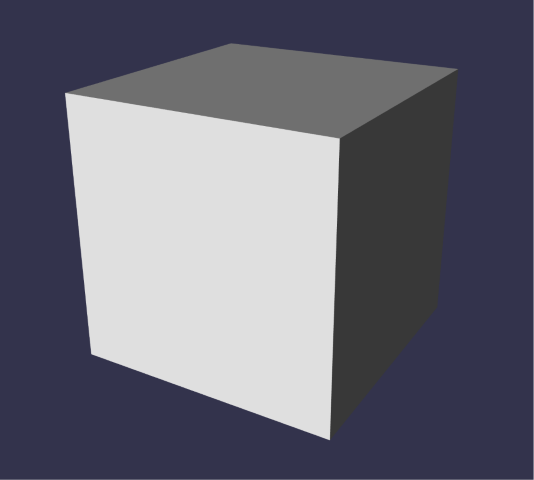

# Babylon Lite Testbed


[](https://github.com/drumath2237/babylonlite-first-testbed-vp/actions/workflows/build_deploy.yml)

## About

[Babylon Lite](https://babylonjs.com/lite/) is a brand new 3D rendering engine made by Babylon.js developer team.
This is a simple project for using Babylon Lite with Vite+.

[Demo](https://drumath2237.github.io/babylonlite-first-testbed-vp/)



## Tested Environment

- Windows 11
- Node.js 24.16.0
- pnpm 11.8.0
- Vite+ 0.2.1
- Babylon Lite 1.2.0

## Install & Usage

```sh
# install dependencies
vp i

# run development server
vp run dev
```

## Author

[drumath2237](https://x.com/ninisan_drumath)
